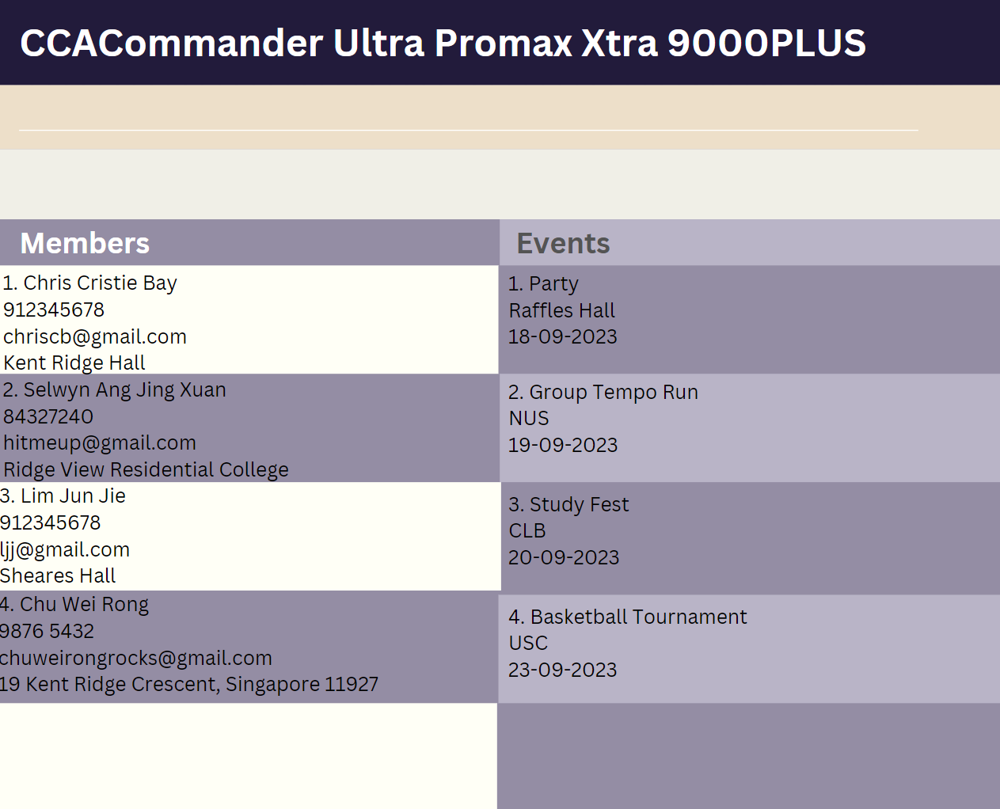

**CCACommander Ultra Promax Xtra 9000+** frees your mind of having to remember your CCA members and events. It's,
* text-based
* easy to learn
* SUPER FAST FAST to use

### Features
1. Add and delete members
2. Add and delete events
3. List all events and members
4. List events of member
5. List members of event
6. Add member to event
7. Delete member from event

### Links
* [Project Website](https://ay2324s1-cs2103t-f11-1.github.io/tp/)
* [User Guide](https://ay2324s1-cs2103t-f11-1.github.io/tp/UserGuide.html)
* [Developer Guide](https://ay2324s1-cs2103t-f11-1.github.io/tp/DeveloperGuide.html)
* [About us](https://ay2324s1-cs2103t-f11-1.github.io/tp/AboutUs.html)

### Acknowlegdements
* This project is a **part of the se-education.org** initiative. If you would like to contribute code to this project, see [se-education.org](https://se-education.org#https://se-education.org/#contributing) for more info.
