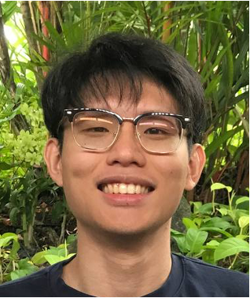
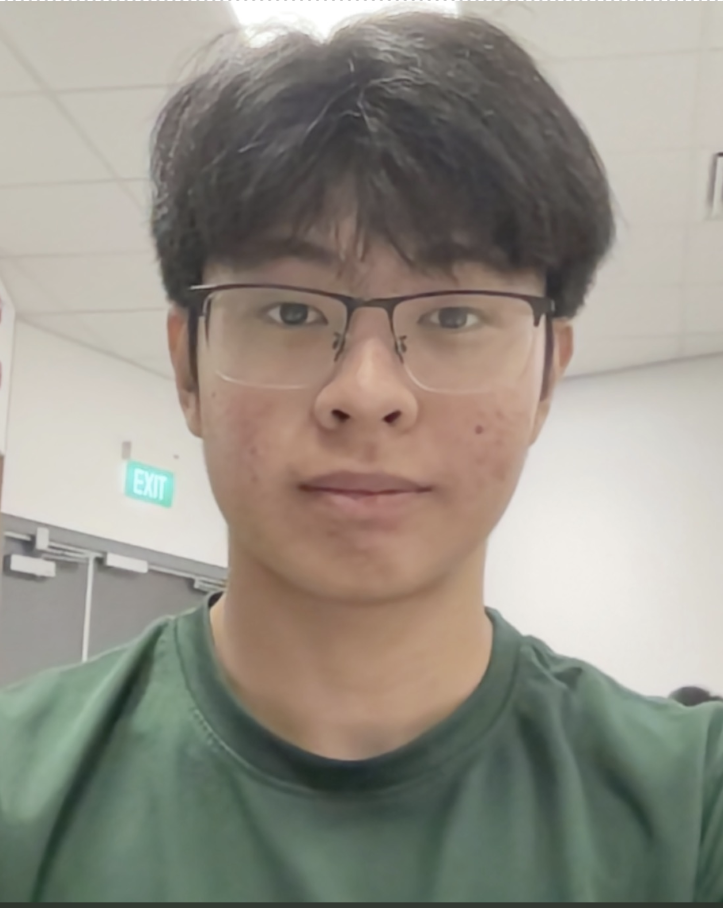
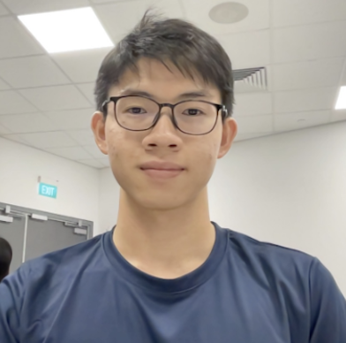

We are a team based in the [School of Computing, National University of Singapore](http://www.comp.nus.edu.sg).

You can reach us at the email `seer[at]comp.nus.edu.sg`

## Project team

### Ang Jing Xuan Selwyn

[[github](https://github.com/SelwynAng)] [[portfolio](team/selwynang.md)] [[email](mailto:selwyn.ang@u.nus.edu)]

* Role: Team Lead
* Responsibilities: Overall team coordination, Code Quality

### Jane Doe

[[github](http://github.com/johndoe)]
[[portfolio](team/johndoe.md)]

* Role: Team Lead
* Responsibilities: UI

### Chu Wei Rong

[[github](http://github.com/wr1159)] [[portfolio](team/wr1159.md)] [[email](mailto:chuweirong@u.nus.edu)]

* Role: Developer
* Responsibilities: Git Expert

### Kaw Jun Rei Dylan

[[github](http://github.com/dylkaw)] [[portfolio](team/dylkaw.md)] [[email](mailto:dylankaw@nus.edu.sg)]

* Role: Developer
* Responsibilities: Deliverables and deadlines

### James Doe

[[github](http://github.com/johndoe)]
[[portfolio](team/johndoe.md)]

* Role: Developer
* Responsibilities: UI
